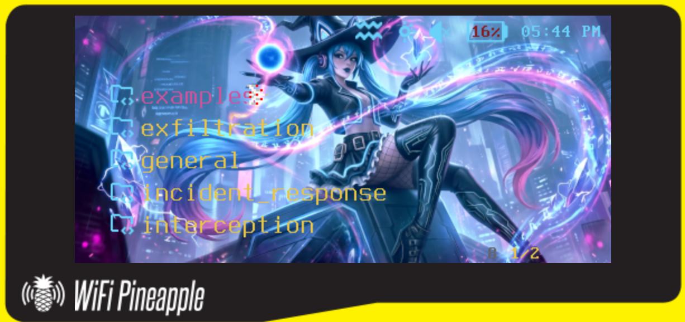

# UwU Underground Pager Theme

Custom theme for WiFi Pineapple Pager (hak5.org)    
    
*There's still a lot to do, tacking the font colors in each dashboard is next

---


## 📁 Quick Theme Structure Overview

```
uwu_underground/
├── theme.json              # Main theme configuration (maps components)
├── assets/                 # Images, icons, backgrounds
│   ├── dashboard/          # Dashboard backgrounds and icons
│   ├── statusbar/          # Status bar icons
│   ├── toggle/             # Toggle switch graphics
│   ├── radio/              # Radio button graphics
│   ├── optiondialog/       # Option dialog backgrounds
│   └── [other folders]     # Various UI element graphics
└── components/             # UI component definitions (JSON files)
    ├── dashboards/         # Main menu screens
    ├── status_bars/        # Status bar configurations
    ├── dialogs/            # Dialog boxes and popups
    ├── templates/          # Reusable UI element templates
    ├── settings/           # Settings menu screens
    ├── recon/              # Recon menu screens
    ├── pineap/             # PineAP menu screens
    ├── alerts/             # Alert/notification screens
    └── keyboards/          # On-screen keyboard layouts

```

**Key Files:**
- `theme.json` - Maps all components and defines color palette
- `components/dashboards/wargames_dashboard.json` - Main dashboard screen
- `assets/` - All images, icons, and graphics (480x222 for full screens)

---

## 🚀 Installation / Replacing Theme on Pager

**Find more information at docs.hak5.org**

1. **Create theme directory at /root/themes**
   ```bash
   # From your pager shell via SSH or Virtual Pager
   mkdir /root/themes
   ```

2. **Transfer uwu_underground theme folder to /root/themes**
   scp or sftp work with the USB-C connection or Management AP by default

3. **Verify theme is recognized:**
   Navigate to settings --> general --> theme and switch to the newly uploaded theme


## 📝 Change Log / Modifications

**Files Modified:**   
*Note: Full size backgrounds should be 480 x 222 pixels

- `assets/alerts_dashboard/alerts_bg.png` - Yuma

- `assets/dashboard/wargames_bg.png` - 5 UwU members

- `assets/payloads_dashboard/payloads_bg.png` - Yuma

- `assets/payloads_dashboard/recon_payloads_bg.png` - Yin
- `assets/blank_recon_bg.png` - Full UwU Team
- `assets/launch_payload_dialog/launch_payload_bg.png` - Yuki
- `assets/settings_bg.png` - Yulia

